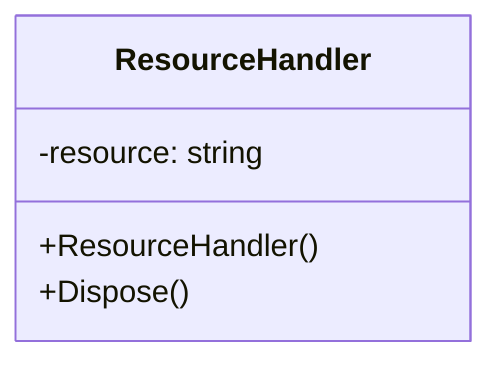
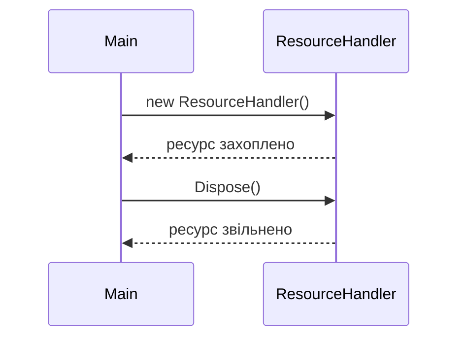

## 🔷 1. RAII (Resource Acquisition Is Initialization)
**Тип:** Creational  
**Призначення:** Автоматичне захоплення та звільнення ресурсу у конструкторі/деструкторі.  

### UML - класів

### UML - послідовності

